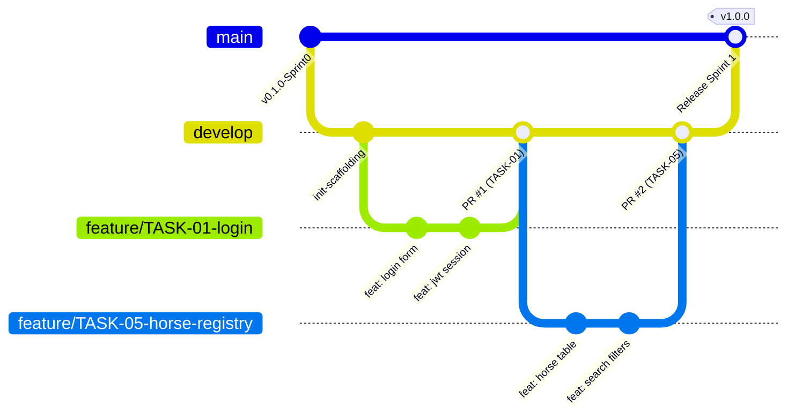

# HƯỚNG DẪN ĐÓNG GÓP & QUY TRÌNH LÀM VIỆC VỚI GIT (CONTRIBUTING GUIDE)
## Dự án: EquiFlow — Horse Training & Racing Club Management System (SWP391)

> Tài liệu này là **quy chuẩn bắt buộc** đối với tất cả thành viên trong nhóm phát triển dự án EquiFlow. Việc tuân thủ quy trình này nhằm đảm bảo tính toàn vẹn của mã nguồn, khả năng truy vết 100% lịch sử phát triển theo từng Task ID, và phục vụ trực tiếp cho việc đánh giá tiến độ của Giảng viên hướng dẫn môn SWP391.

---

## MỤC LỤC
1. [Mô hình nhánh (Branching Model)](#1-mô-hình-nhánh-branching-model)
2. [Đặt tên nhánh (Branch Naming)](#2-đặt-tên-nhánh-branch-naming)
3. [Quy ước Commit (Commit Conventions)](#3-quy-ước-commit-commit-conventions)
4. [Quy trình Pull Request (Pull Request Workflow)](#4-quy-trình-pull-request-pull-request-workflow)
5. [Quy trình Review Code (Code Review Process)](#5-quy-trình-review-code-code-review-process)
6. [Merge và Xử lý Xung đột (Merge & Conflict Resolution)](#6-merge-và-xử-lý-xung-đột-merge--conflict-resolution)
7. [Definition of Done (DoD — Tiêu chí hoàn thành Task)](#7-definition-of-done-dod--tiêu-chí-hoàn-thành-task)
8. [Những thứ tuyệt đối không được commit (Git Hygiene)](#8-những-thứ-tuyệt-đối-không-được-commit-git-hygiene)
9. [Tra nhanh câu lệnh Git thường dùng (Git Cheat Sheet)](#9-tra-nhanh-câu-lệnh-git-thường-dùng-git-cheat-sheet)

---

## 1. MÔ HÌNH NHÁNH (BRANCHING MODEL)

Hệ thống áp dụng mô hình **Gitflow rút gọn (Feature-Branch Workflow)** phù hợp với quy mô dự án đại học và đồ án tốt nghiệp:



### Các loại nhánh chính:
* **`main` / `master` (Production Branch)**:
  * Nhánh chứa mã nguồn ổn định nhất, đã qua kiểm thử và được bảo vệ (`Protected Branch`).
  * Tuyệt đối **không commit trực tiếp** lên `main`.
  * Chỉ merge từ `develop` vào cuối mỗi Sprint (khi bảo vệ Milestone hoặc nghiệm thu đồ án).
* **`develop` (Integration Branch)**:
  * Nhánh làm việc tích hợp chung của toàn bộ 4 thành viên.
  * Mọi tính năng sau khi được kiểm thử và review xong sẽ được merge vào đây.
* **`feature/TASK-<Mã>-<slug>` (Feature Branches)**:
  * Nhánh con được tách ra từ `develop` để thực hiện một task cụ thể trong bảng phân công.
  * Mỗi thành viên chỉ làm việc trên nhánh feature tương ứng với task được giao.
* **`bugfix/TASK-<Mã>-<slug>` (Bugfix Branches)**:
  * Dùng để sửa các lỗi phát sinh trong quá trình kiểm thử nội bộ của Sprint hiện tại. Tách từ `develop`.
* **`hotfix/<slug>` (Hotfix Branches)**:
  * Dùng trong tình huống khẩn cấp (ví dụ: lỗi crash server ngay trước giờ thuyết trình với hội đồng). Tách trực tiếp từ `main`, sửa xong merge vào cả `main` và `develop`.

---

## 2. ĐẶT TÊN NHÁNH (BRANCH NAMING)

Mọi nhánh công việc đều **BẮT BUỘC** phải gắn liền với **Mã Task** trong bảng phân công để bot GitHub tự động nhận diện và kiểm tra:

### Cú pháp quy chuẩn:
```text
feature/TASK-<Mã>-<slug-chức-năng>
bugfix/TASK-<Mã>-<slug-lỗi>
```

### Quy tắc chi tiết:
1. Tiền tố: `feature/` đối với tính năng mới, `bugfix/` đối với sửa lỗi.
2. Mã task: Viết hoa `TASK-<Số>` (ví dụ: `TASK-01`, `TASK-17`, `TASK-23`).
3. Tên slug: Viết thường không dấu, các từ nối nhau bằng dấu gạch ngang (`-`), ngắn gọn (2–4 từ tiếng Anh).
4. Tuyệt đối không dùng dấu cách, ký tự đặc biệt, hoặc tiếng Việt có dấu trong tên nhánh.

### Bảng ví dụ:
| Nhánh hợp lệ (Valid) ✅ | Nhánh KHÔNG hợp lệ (Invalid) ❌ | Lý do lỗi |
|---|---|---|
| `feature/TASK-01-login-screen` | `feature/login` | Thiếu Mã Task (`TASK-01`) |
| `feature/TASK-06-horse-profile` | `task-6-horse` | Sai format, thiếu prefix `feature/` |
| `feature/TASK-17-training-wizard` | `feature/TASK_17_training` | Dùng dấu gạch dưới `_` thay vì `-` |
| `bugfix/TASK-23-lock-toggle-fix` | `feature/fix-loi-dang-nhap` | Tên tiếng Việt, sai tiền tố `bugfix/` |

---

## 3. QUY ƯỚC COMMIT (COMMIT CONVENTIONS)

Dự án áp dụng chuẩn **Conventional Commits kết hợp Task ID**. Mỗi commit là một đơn vị công việc rõ ràng, giúp toàn đội và giảng viên khi chạy `git log` có thể hiểu ngay lập tức nội dung thay đổi.

### Cú pháp bắt buộc:
```text
[TASK-<Mã>] <type>(<scope>): <mô tả ngắn gọn bằng tiếng Anh hoặc tiếng Việt không dấu>
```

### Các loại commit (`type`):
* **`feat`**: Bổ sung chức năng mới của task (Feature).
* **`fix`**: Sửa lỗi của task (Bug fix).
* **`style`**: Căn chỉnh giao diện CSS, căn lề, đổi token màu, không thay đổi logic code.
* **`refactor`**: Tái cấu trúc mã nguồn, tối ưu hóa code hoặc chia nhỏ component/service.
* **`test`**: Viết bổ sung unit test, integration test hoặc e2e test.
* **`docs`**: Cập nhật tài liệu kỹ thuật, SRS, README hoặc sơ đồ.
* **`chore`**: Cấu hình build, package.json, cài đặt thư viện phụ trợ.

### Các phạm vi (`scope`):
* `auth`, `accounts`, `horses`, `training`, `health`, `stables`, `racing`, `dashboard`, `audit-log`, `rbac`, `db`.

### Ví dụ chuẩn mực:
```bash
# Thêm tính năng
git commit -m "[TASK-01] feat(auth): implement login form with jwt cookie session"
git commit -m "[TASK-17] feat(training): create step 1 and step 2 of training plan wizard"
git commit -m "[TASK-23] feat(health): implement emergency training lock switch"

# Sửa lỗi
git commit -m "[TASK-02] fix(auth): resolve otp expiration timer reset on resend"
git commit -m "[TASK-18] fix(training): prevent scheduling session on injured horse"

# Căn chỉnh giao diện
git commit -m "[TASK-07] style(horses): adjust bento box card grid for 1440px desktop"

# Tái cấu trúc
git commit -m "[TASK-06] refactor(horses): split horse edit form into modular sub-components"
```

---

## 4. QUY TRÌNH PULL REQUEST (PULL REQUEST WORKFLOW)

Mọi đoạn mã chỉ được đưa vào nhánh `develop` thông qua **Pull Request (PR)** trên GitHub.

### 4.1. Tiêu đề Pull Request
Tiêu đề PR phải tuân thủ đúng cú pháp để GitHub Bot kiểm tra:
```text
[TASK-<Mã>] <Loại commit>: <Tên ngắn gọn của tính năng>
```
* *Ví dụ*: `[TASK-01] feat(auth): Màn hình đăng nhập và xác thực phân quyền 5 Actor`
* *Ví dụ*: `[TASK-17] feat(training): Trình tạo giáo án huấn luyện nhiều bước`

### 4.2. Mẫu nội dung Pull Request (PR Template)
Khi tạo PR, thành viên bắt buộc phải điền đầy đủ các mục trong mẫu sau:

```markdown
## 📌 Thông tin Task
* **Mã Task**: TASK-XX
* **Chức năng**: (Tên chức năng / Màn hình)
* **Thành viên phụ trách**: (M.1 / M.2 / M.3 / M.4)
* **Sprint**: (Sprint 1 / 2 / 3)

## 🛠️ Những thay đổi đã thực hiện
* [x] Tạo giao diện màn hình theo thiết kế Design System.
* [x] Kết nối API NestJS backend tương ứng.
* [x] Đã xử lý đủ 4 trạng thái UI: Loading, Empty, Error, DisabledHint.
* [x] Đã kiểm tra ràng buộc nghiệp vụ (Business Rules).

## 📸 Bằng chứng kiểm thử (Screenshots / Video)
> Đính kèm ảnh chụp màn hình hoặc link video chạy thử chứng minh tính năng hoạt động:
(Chèn ảnh chụp màn hình kết quả tại đây)

## ✅ Self-Checklist của Developer trước khi tạo PR
* [ ] Nhánh đã rebase với `origin/develop` mới nhất, không có xung đột (No Conflict).
* [ ] Đã chạy `npm run lint` ở frontend (0 errors).
* [ ] Đã chạy `npm run build` ở cả backend và frontend thành công.
* [ ] Không còn `console.log` thừa hoặc mã nguồn rác chưa dọn dẹp.
```

---

## 5. QUY TRÌNH REVIEW CODE (CODE REVIEW PROCESS)

Review code là trách nhiệm chung của cả nhóm nhằm đảm bảo chất lượng đồ án và tránh lỗi lan truyền sang các Sprint sau.

### Quy định chung:
* Mỗi PR phải có **ít nhất 1 thành viên khác** hoặc **Tech Lead (M.1)** xem xét và bấm **`Approve`** thì mới được phép merge.
* Người tạo PR không được tự duyệt PR của chính mình.
* Thời gian phản hồi review tối đa là **24 giờ** kể từ khi mở PR.

### Tiêu chí kiểm tra của Reviewer (Review Checklist):
1. **Tính đúng đắn của Nghiệp vụ**: Có thỏa mãn 100% các tiêu chí trong cột *Business Rule* của task không?
2. **Chuẩn UI/UX**: Có sử dụng biến CSS token trong `tokens.css` không? (Tuyệt đối từ chối nếu viết màu inline tùy tiện hoặc dùng TailwindCSS sai quy định).
3. **Độ an toàn & Ngoại lệ**: Form có validate đầu vào không? Có xử lý trường hợp mất mạng / lỗi server 500 không?
4. **Bảo mật**: Có hardcode mật khẩu, email hoặc secret token không?

---

## 6. MERGE VÀ XỬ LÝ XUNG ĐỘT (MERGE & CONFLICT RESOLUTION)

### 6.1. Chiến lược Merge
Dự án sử dụng chiến lược **Squash and Merge** khi gộp PR vào nhánh `develop`:
* Toàn bộ các commit nhỏ lẻ trên nhánh feature sẽ được nén thành **1 commit duy nhất** trên `develop`.
* Giữ cho lịch sử Git của nhánh `develop` cực kỳ sạch sẽ, mỗi commit trên `develop` tương ứng chính xác với 1 Task ID.

### 6.2. Cách xử lý xung đột (Git Conflict Resolution)
Nếu nhánh của bạn bị báo `This branch has conflicts that must be resolved`:

```bash
# Bước 1: Chuyển về nhánh develop và kéo code mới nhất về
git checkout develop
git pull origin develop

# Bước 2: Chuyển về nhánh feature của bạn
git checkout feature/TASK-XX-your-feature

# Bước 3: Rebase code mới nhất từ develop vào nhánh của bạn
git rebase develop

# Bước 4: Mở VS Code, các file bị conflict sẽ hiển thị màu đỏ
# Chọn "Accept Current Change", "Accept Incoming Change" hoặc chỉnh sửa thủ công cho hợp lý
# Sau khi sửa xong từng file:
git add <tên-file-đã-sửa>

# Bước 5: Tiếp tục quá trình rebase
git rebase --continue
# (Lặp lại cho đến khi rebase hoàn tất)

# Bước 6: Đẩy lại nhánh lên GitHub (dùng cờ --force-with-lease an toàn)
git push --force-with-lease origin feature/TASK-XX-your-feature
```

---

## 7. DEFINITION OF DONE (DoD — TIÊU CHÍ HOÀN THÀNH TASK)

Một Task chỉ được đánh dấu là **`Done`** trên bảng phân công Excel khi thỏa mãn đầy đủ **7 điều kiện** sau:

1. [ ] **Build thành công**: Chạy lệnh `npm run build` ở cả `backend/` và `frontend/` đều thành công (0 lỗi biên dịch TypeScript).
2. [ ] **Linting sạch**: Chạy `npm run lint` (oxlint) không có cảnh báo lỗi cú pháp.
3. [ ] **Đủ 4 trạng thái giao diện**: Mọi màn hình đều có:
   * *Loading State*: Khung xương hiển thị (Skeleton loading).
   * *Empty State*: Bảng hoặc danh sách rỗng có hình minh họa và hướng dẫn hành động.
   * *Error State*: Thông báo lỗi rõ ràng và nút bấm Thử lại (Retry).
   * *DisabledHint*: Nút bị khóa có tooltip giải thích nguyên nhân (ví dụ: bị khóa bởi lệnh Training Lock của Bác sĩ).
4. [ ] **Thỏa mãn Business Rule**: Chức năng đáp ứng đầy đủ quy tắc nghiệp vụ quy định trong [PRD.md](PRD.md).
5. [ ] **Không sót rác debug**: Đã xóa toàn bộ `console.log` thừa, code comment không dùng đến.
6. [ ] **Có bằng chứng kiểm thử**: Đã đính kèm ảnh chụp màn hình / GIF chạy thử vào Pull Request.
7. [ ] **PR đã được duyệt & merge**: Đã có ít nhất 1 Approve và được merge vào nhánh `develop`.

---

## 8. NHỮNG THỨ TUYỆT ĐỐI KHÔNG ĐƯỢC COMMIT (GIT HYGIENE)

Các thành viên phải luôn chú ý kiểm tra lệnh `git status` trước khi `git add .`. Tuyệt đối **KHÔNG ĐƯỢC COMMIT** các mục sau lên GitHub:

* ❌ **File cấu hình chứa bí mật**: `.env`, `.env.local`, `.env.production` (chỉ được commit file mẫu `.env.example`).
* ❌ **Thư mục phụ thuộc**: `node_modules/`, `package-lock.json` nếu có xung đột phiên bản không mong muốn.
* ❌ **Thư mục đầu ra biên dịch**: `dist/`, `build/`, `.output/`.
* ❌ **File sinh tự động từ hệ điều hành / IDE**:
  * `.DS_Store` (macOS), `Thumbs.db` (Windows).
  * `.vscode/` (trừ khi có file cấu hình mở rộng chung đã thống nhất), `.idea/`.
* ❌ **File nhật ký / logs**: `npm-debug.log`, `yarn-error.log`, `*.log`.
* ❌ **Dữ liệu nhị phân nặng**: Video quay màn hình độ phân giải cao (`.mp4`, `.mov > 25MB`), file backup cơ sở dữ liệu lớn (`.dump`, `.sql` nặng hàng trăm MB). Nên nén hoặc lưu trữ trên Google Drive / Supabase Storage.

> 💡 *Mẹo*: Nếu vô tình lỡ commit file nhạy cảm, hãy thông báo ngay cho Tech Lead để dùng lệnh `git filter-repo` gỡ bỏ lịch sử, không tự ý push đè gây hỏng repository.

---

## 9. TRA NHANH CÂU LỆNH GIT THƯỜNG DÙNG (GIT CHEAT SHEET)

| Thao tác | Câu lệnh Git | Giải thích |
|---|---|---|
| **Bắt đầu ngày mới** | `git checkout develop && git pull origin develop` | Lấy code mới nhất về máy |
| **Tạo nhánh task mới** | `git checkout -b feature/TASK-XX-ten-chuc-nang` | Tạo nhánh và chuyển sang nhánh mới |
| **Kiểm tra trạng thái** | `git status` | Xem các file đã sửa/thêm mới |
| **Lưu thay đổi tạm thời** | `git stash` / `git stash pop` | Cất tạm code khi cần đổi nhánh gấp |
| **Thêm file vào commit** | `git add .` (hoặc `git add <file>`) | Đưa file vào khu vực chuẩn bị commit |
| **Tạo commit chuẩn** | `git commit -m "[TASK-XX] feat(scope): message"` | Lưu commit kèm mã task chuẩn hóa |
| **Đẩy nhánh lên GitHub** | `git push -u origin feature/TASK-XX-ten-nhanh` | Đẩy nhánh lên remote để tạo PR |
| **Đồng bộ code từ develop**| `git fetch origin && git rebase origin/develop` | Cập nhật code mới tránh conflict |
| **Đẩy đè sau khi rebase** | `git push --force-with-lease origin <tên-nhánh>` | Đẩy an toàn sau khi giải quyết conflict |
| **Xem lịch sử commit đẹp** | `git log --oneline --graph --decorate -n 10` | Xem cây commit dạng rút gọn có màu |
| **Hủy bỏ sửa đổi chưa add** | `git restore <file>` | Khôi phục file về trạng thái ban đầu |

---
*Tài liệu này được biên soạn bởi Nhóm EquiFlow — SWP391. Mọi thắc mắc trong quá trình làm việc vui lòng thảo luận trực tiếp trong nhóm trao đổi kỹ thuật.*
