# QUY TRÌNH LÀM VIỆC GIT & BẢNG PHÂN CÔNG TÁC VỤ DỰ ÁN EQUIFLOW (SWP391)

> **Dự án**: EquiFlow — Horse Training & Racing Club Management System  
> **Thời điểm hiện tại**: Tuần 3 (24/09/2026) — Đã kết thúc Sprint 0  
> **File Excel phân công chính thức**: `EquiFlow_Bang_Phan_Cong_Task_SWP391.xlsx` (Lưu hành nội bộ nhóm / Drive)

---

## 1. SƠ ĐỒ TỔNG THỂ USE CASE (HỆ THỐNG ĐỒ ÁN SWP391)

Hệ thống EquiFlow gồm **5 Actor chính** tương tác trên 5 phân hệ nghiệp vụ chuẩn hóa:

```mermaid
flowchart TB
    subgraph Actors["5 System Actors"]
        CM["Club Manager (Quản lý CLB)"]
        HT["Head Trainer (HLV Trưởng)"]
        VET["Veterinarian (Bác sĩ Thú y)"]
        GR["Groom / Stable Hand (Chăm sóc)"]
        HO["Horse Owner (Chủ ngựa)"]
    end

    subgraph Auth["Phân hệ Xác thực & Phân quyền (Flow 0)"]
        UC_Auth1["UC-01: Đăng nhập & Xác thực JWT"]
        UC_Auth2["UC-02: Đăng ký & Kích hoạt OTP"]
        UC_Auth3["UC-03: Quản lý Tài khoản & Gán Role (RBAC)"]
    end

    subgraph Master["Phân hệ Hồ sơ Ngựa & Danh mục (Flow 1)"]
        UC_H1["UC-04: Quản lý Hồ sơ Cá thể Ngựa"]
        UC_H2["UC-05: Tiếp nhận Ngựa mới (Intake) & Gán Chuồng"]
        UC_H3["UC-06: Gán Quyền Sở Hữu (Owner Assignment)"]
    end

    subgraph Training["Phân hệ Huấn luyện & Chạy thử (Flow 2)"]
        UC_T1["UC-07: Lập Giáo án Huấn luyện (Wizard)"]
        UC_T2["UC-08: Lịch Tập luyện & Phân công Jockey"]
        UC_T3["UC-09: Ghi nhận Lượt Chạy Thử (Trial Runs)"]
        UC_T4["UC-10: Đánh giá Phong độ & Chấm điểm"]
    end

    subgraph Medical["Phân hệ Y tế & Chấn thương (Flow 3)"]
        UC_M1["UC-11: Sơ đồ Sức khỏe Đàn Ngựa (4 Mã Màu)"]
        UC_M2["UC-12: Bệnh án & Đơn thuốc (Withdrawal Days)"]
        UC_M3["UC-13: Bản đồ Chấn thương Tương tác (2D Anatomy)"]
        UC_M4["UC-14: Lệnh Khóa Huấn luyện (Training Lock)"]
        UC_M5["UC-15: Lịch Tiêm phòng & Tẩy giun (Farrier)"]
    end

    subgraph Stables["Phân hệ Chuồng trại & Dinh dưỡng (Flow 4)"]
        UC_S1["UC-16: Sơ đồ Vị trí Chuồng trại (Stall Map)"]
        UC_S2["UC-17: Khẩu phần Dinh dưỡng theo bữa"]
        UC_S3["UC-18: Checklist Công việc Di động Groom"]
        UC_S4["UC-19: Báo cáo Sự cố Chuồng trại kèm Ảnh"]
    end

    subgraph Racing["Phân hệ Giải đua & Báo cáo (Flow 5 & Workflow 3)"]
        UC_R1["UC-20: Đăng ký Giải Đua (Race Entry)"]
        UC_R2["UC-21: Bảng Kết quả Đua & Thành tích"]
        UC_D1["UC-22: Dashboard Thể lực Đàn Ngựa (Head Trainer)"]
        UC_D2["UC-23: Dashboard Điều hành Vận hành (Club Manager)"]
        UC_D3["UC-24: Portal & Sao kê Tài chính (Horse Owner)"]
        UC_D4["UC-25: Tra cứu Nhật ký Kiểm toán (Audit Log)"]
    end

    %% Actor Connections
    CM --> UC_Auth3
    CM --> UC_H1
    CM --> UC_H2
    CM --> UC_H3
    CM --> UC_D2
    CM --> UC_D4

    HT --> UC_T1
    HT --> UC_T2
    HT --> UC_T3
    HT --> UC_T4
    HT --> UC_R1
    HT --> UC_R2
    HT --> UC_D1

    VET --> UC_M1
    VET --> UC_M2
    VET --> UC_M3
    VET --> UC_M4
    VET --> UC_M5
    VET --> UC_H2

    GR --> UC_S1
    GR --> UC_S2
    GR --> UC_S3
    GR --> UC_S4

    HO --> UC_D3
    HO --> UC_H1

    AllActors["Tất cả 5 Actor"] --> UC_Auth1
    AllActors --> UC_Auth2

    %% Exceptional Links
    UC_M4 -.->|<<interfere / blocks>>| UC_T1
    UC_M4 -.->|<<interfere / blocks>>| UC_T2
    UC_M4 -.->|<<blocks race registration>>| UC_R1
```



---

## 2. QUY CHUẨN ĐÁNH GIÁ ĐỘ PHỨC TẠP CỦA TASK

| Mức độ | Tiêu chuẩn số Trans/Screens (N) | Đặc điểm nhận diện kỹ thuật | Ví dụ thực tế trong dự án | Điểm quy đổi (Effort) |
|---|---|---|---|:---:|
| **Simple** | `N < 3` | Màn hình tĩnh, tra cứu danh mục, CRUD bảng đơn giản, form ít trường, không liên kết chéo. | Đăng nhập (`username`, `password`), Quên mật khẩu, Danh mục chuồng trại, Danh bạ nhân sự | **1 pt** |
| **Medium** | `3 <= N <= 8` | Form đa trường có validate chặt chẽ, bảng dữ liệu lọc/tìm kiếm/phân trang, upload ảnh/file, checklist ca trực di động. | Đăng ký & OTP, Horse Profile CRUD, Quản lý tài khoản RBAC, Lịch tiêm phòng, Checklist Groom | **2 pts** |
| **Complex** | `N > 8` | Nghiệp vụ liên phòng ban (multi-actor), wizard nhiều bước, sơ đồ đồ họa tương tác (2D Anatomy Map), logic khóa chéo (Training Lock chặn lịch tập), Dashboard Bento tổng hợp nhiều nguồn. | Trình tạo Giáo án Huấn luyện, Lịch tập Calendar, Bản đồ chấn thương 2D, Cơ chế Training Lock / Release, Bento Dashboards, E2E Testing | **4 pts** |

---

## 3. LỘ TRÌNH THỜI GIAN THEO TUẦN (SPRINT TIMELINE)

- **Hiện tại**: Tuần 3 (24/09/2026) — Đã kết thúc Sprint 0 (Setup dự án, PRD v2.0, Kiến trúc, Prototype Auth).
- **Sprint 1 (Tuần 4 - 5: 28/09 - 11/10/2026)**: Hoàn thiện Auth/RBAC 5 vai trò + Master Data Hồ sơ ngựa, Chuồng trại, Nhân sự.
- **Sprint 2 (Tuần 6 - 7: 12/10 - 25/10/2026)**: Nghiệp vụ Lõi (Core Transactions): Huấn luyện & Chạy thử (Flow 2) + Y tế chuyên sâu & Training Lock (Flow 3) + Chuồng trại Groom (Flow 4).
- **Sprint 3 (Tuần 8 - 9: 26/10 - 08/11/2026)**: Dashboard Bento Box đa vai trò (Workflow 3) + Đăng ký giải đua (Flow 5) + Báo cáo tài chính + E2E Testing toàn hệ thống.
- **Week 10 (Tuần 10: 09/11 - 15/11/2026)**: Đóng gói sản phẩm, chuẩn bị dữ liệu demo Thiên Mã Club, Slide thuyết trình & **BẢO VỆ ĐỒ ÁN TỐT NGHIỆP / SWP391**.

---

## 4. QUY TRÌNH LÀM VIỆC VỚI GIT & COMMIT THEO MÃ TASK

Để đảm bảo giảng viên và cả 4 thành viên nhìn vào Git history là biết ngay **ai làm task nào, chức năng gì, sprint nào**, toàn đội tuân thủ quy chuẩn sau:

### 4.1. Cấu trúc nhánh (Branching Strategy)
- `master`: Nhánh mã nguồn chính thức (Production). Chỉ merge từ `develop` khi nghiệm thu cuối Sprint hoặc nộp bài.
- `develop`: Nhánh tích hợp làm việc chung của cả nhóm.
- `feature/TASK-<Mã>-<slug>`: Nhánh con của từng task (tách ra từ `develop`).
  - *Ví dụ*: `feature/TASK-01-login`, `feature/TASK-17-training-plan-wizard`, `feature/TASK-23-training-lock`
- `bugfix/TASK-<Mã>-<slug>`: Nhánh sửa lỗi kiểm thử cho task cụ thể.

### 4.2. Cú pháp Commit Message bắt buộc
```text
[TASK-<Mã>] <type>(<scope>): <mô tả ngắn bằng tiếng Anh hoặc tiếng Việt>
```

**Các `type` chuẩn hóa:**
- `feat`: Tính năng mới của task (`[TASK-01] feat(auth): implement login form and jwt cookie`)
- `fix`: Sửa lỗi của task (`[TASK-02] fix(auth): resolve otp expiry countdown reset`)
- `style`: Căn chỉnh giao diện, CSS tokens, responsive (`[TASK-07] style(bento): polish bento layout`)
- `refactor`: Tối ưu hóa code nhưng không đổi tính năng (`[TASK-06] refactor(horse): split modular components`)
- `test`: Bổ sung kiểm thử unit/e2e (`[TASK-29] test(rbac): add e2e test for 403 owner isolation`)
- `docs`: Bổ sung tài liệu (`[TASK-43] docs(srs): add usecase specs for flow 2 and 3`)

### 4.3. Quy trình 6 bước thao tác Git hàng ngày
1. **Bước 1**: Cập nhật mã nguồn mới nhất từ nhánh `develop`:
   ```bash
   git checkout develop
   git pull origin develop
   ```
2. **Bước 2**: Tạo nhánh làm việc theo Mã Task được giao:
   ```bash
   git checkout -b feature/TASK-17-training-plan-wizard
   ```
3. **Bước 3**: Lập trình, chạy test và commit theo đúng cú pháp mã task:
   ```bash
   git add .
   git commit -m "[TASK-17] feat(training): build wizard step 1 and step 2"
   ```
4. **Bước 4**: Trước khi đẩy code lên, đồng bộ lại với `develop` để tránh xung đột:
   ```bash
   git fetch origin
   git rebase origin/develop   # hoặc git merge origin/develop
   ```
5. **Bước 5**: Push nhánh lên GitHub và tạo Pull Request (PR):
   ```bash
   git push -u origin feature/TASK-17-training-plan-wizard
   ```
   *Tiêu đề PR*: `[TASK-17] Trình tạo Giáo án Huấn luyện (Training Plan Wizard)`
6. **Bước 6**: Ít nhất 1 thành viên khác (hoặc Tech Lead `M.1`) duyệt code, xác nhận không có conflict và bấm **Squash and Merge** vào `develop`.

---

## 5. BẢNG TỔNG HỢP CÂN BẰNG KHỐI LƯỢNG (WORKLOAD BALANCING)

| Thành viên | Phân hệ chuyên trách | Simple (1 pt) | Medium (2 pts) | Complex (4 pts) | Tổng Tasks | Tổng Effort Points | Tỷ lệ đóng góp |
|:---:|---|:---:|:---:|:---:|:---:|:---:|:---:|
| **M.1** | Auth, RBAC, Security Guard, Audit Logs, Club Manager Dashboard, Tích hợp E2E | 3 | 5 | 4 | **12** | **29 pts** | **25.2%** |
| **M.2** | Horse Master Data, Tiếp nhận ngựa, Chuồng trại & Dinh dưỡng (Groom), UI Polish | 0 | 8 | 3 | **11** | **28 pts** | **24.3%** |
| **M.3** | Danh mục nền tảng, Giáo án huấn luyện, Lịch tập, Lượt chạy thử, Đăng ký giải đua | 4 | 5 | 3 | **12** | **26 pts** | **22.6%** |
| **M.4** | Sơ đồ sức khỏe, Bệnh án thú y, Bản đồ chấn thương 2D, Training Lock, Báo cáo Chủ ngựa | 2 | 5 | 4 | **11** | **32 pts** | **27.8%** |
| **TỔNG** | **Toàn bộ hệ thống EquiFlow** | **9** | **23** | **14** | **46** | **115 pts** | **100.0%** |

*Chi tiết toàn bộ 46 tasks từ Sprint 1 đến Week 10 được thể hiện đầy đủ trong bảng dưới đây và trong file Excel [`EquiFlow_Bang_Phan_Cong_Task_SWP391.xlsx`](../EquiFlow_Bang_Phan_Cong_Task_SWP391.xlsx).*
